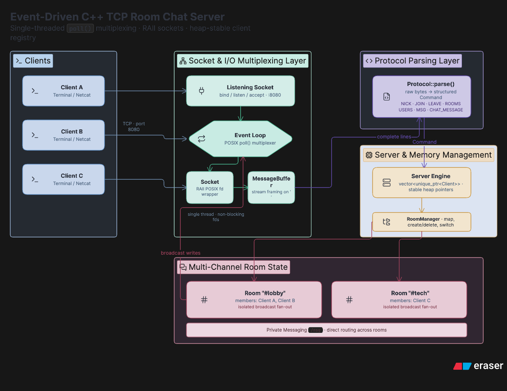

# Event-Driven TCP Room Chat Server

A high-performance, non-blocking, multi-channel TCP chat server written in C++17 using raw POSIX system calls (`poll()`, `socket`, `bind`, `listen`, `accept`, `recv`, `send`) with zero external dependencies.

---

## Technical Features

- **Event-Driven I/O Multiplexing**: Built on a POSIX `poll()` event loop to handle concurrent client connections asynchronously on a single thread.
- **Room and Channel Isolation**: Supports dynamic creation and cleanup of chat channels (`#lobby`, `#tech`, etc.). Messages are broadcast exclusively to members of the sender's active room.
- **Thread-Safe State Management**: Mutex-guarded room state with heap-allocated `std::unique_ptr<Client>` references to guarantee pointer stability across client connections and disconnections.
- **Private Messaging**: Supports direct user-to-user messaging (`/msg <user> <message>`) across rooms.
- **TCP Stream Framing**: Custom `MessageBuffer` handling stream fragmentation and line-delimited message assembly (`\n`).
- **Decoupled Protocol Parser**: Clean separation of socket I/O and command parsing (`/nick`, `/join`, `/leave`, `/rooms`, `/users`, `/msg`, `/help`).

---

## Architecture



---

## Command Reference

| Command | Arguments | Description |
| :--- | :--- | :--- |
| `/nick` | `<name>` | Change display username |
| `/join` | `<room_name>` | Join or create a room (e.g., `/join #tech`) |
| `/leave` | *None* | Leave current room and return to default `#lobby` |
| `/rooms` | *None* | List active rooms and user counts |
| `/users` | *None* | List users in current room |
| `/msg` | `<user> <message>` | Send a private message to an online user |
| `/help` | *None* | Display command list |

---

## Build & Usage

### Prerequisites
- C++17 compliant compiler (`g++` or `clang++`)
- CMake (v3.10+)
- POSIX OS (Linux / macOS / WSL)

### Build
```bash
cmake -B build
cmake --build build
```

### Run
```bash
./build/chat_server
```

### Connect via Terminal
Connect using `netcat` or `telnet`:

```bash
nc localhost 8080
```

